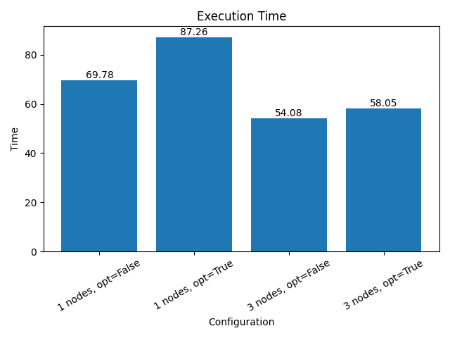
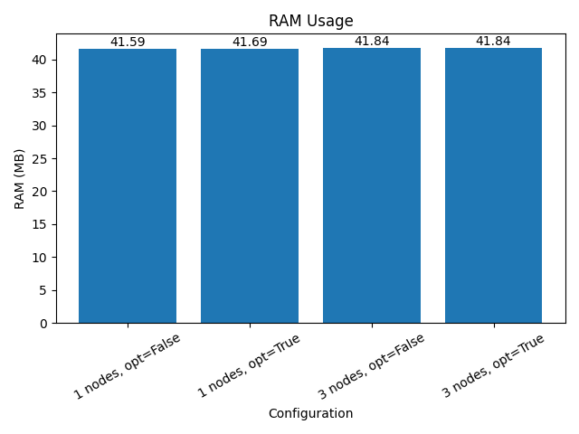

# Лабораторная работа 2

## Датасет
 
https://www.kaggle.com/datasets/dhrubangtalukdar/telco-customer-churn-data 

- Задача: бинарная классификация (Churn prediction)
- Размер: 100000 строк
- Типы данных: string, int, double
- Признаки: 8 (CustomerID, Gender, Contract, PaymentMethod, Age, Tenure, MonthlyCharges, TotalCharges)

---

## Эксперименты

Проведено 4 эксперимента:

| № | Nodes | Optimized | Описание |
|--|------|----------|----------|
| 1 | 1 | False | Базовый запуск |
| 2 | 1 | True | Оптимизация (cache + repartition) |
| 3 | 3 | False | Масштабирование кластера |
| 4 | 3 | True | Масштабирование + оптимизация |

---


## Запуск

```
./run.sh --nodes 1 --optimized False 
./run.sh --nodes 1 --optimized True 
./run.sh --nodes 3 --optimized False
./run.sh --nodes 3 --optimized True
```

## Результаты

| Nodes | Optimized | Time (s) | RAM (MB) | AUC |
|------|----------|---------|---------|------|
| 1 | False | 69.78 | 41.59 | 0.7658 |
| 1 | True | 87.26 | 41.69 | 0.7580 |
| 3 | False | 54.08 | 41.84 | 0.7658 |
| 3 | True | 58.05 | 41.84 | 0.7580 |

---


|  График 1 | График 2 |
|----------|----------|
|   |  |

## Анализ результатов

### Время выполнения

Увеличение количества DataNode с 1 до 3 привело к снижению времени выполнения: с 69.78 до 54.08 секунд. Это объясняется распределением вычислений между несколькими узлами и более эффективной обработкой данных. Включение оптимизации (cache и repartition) не дало положительного эффекта — наоборот, время увеличилось в обоих случаях. Вероятно, это связано с небольшим размером датасета, при котором накладные расходы на оптимизацию превышают выигрыш.

### Использование памяти

Использование оперативной памяти осталось практически неизменным во всех экспериментах и составило около 41–42 MB. Это говорит о том, что ни масштабирование кластера, ни включение оптимизаций существенно не повлияли на потребление памяти. Основная нагрузка приходится на драйвер Spark, а не на распределённые вычисления. Таким образом, для данного объёма данных память не является узким местом системы.